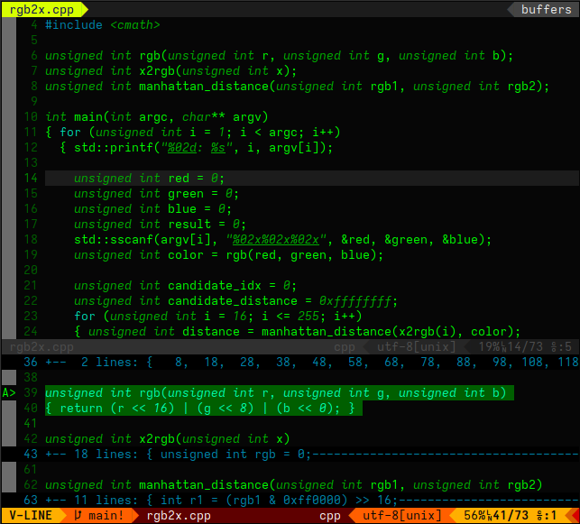

# greenish.vim



# rgb2x

Consume as parameter list of the RGB codes and prints list of th 256-color
terminal codes with conversion error as manhattan distance. First 16 colors
of terminal color codes are not used.

Example:

```
$> ./rgb2x ff0000 00ff00 0000ff 000000 ffffff
01: ff0000 : 196 (distance:   0)
02: 00ff00 : 046 (distance:   0)
03: 0000ff : 021 (distance:   0)
04: 000000 : 016 (distance:   0)
05: ffffff : 231 (distance:   0)
```

# x2rgb

Consumes as parameter list of the 256-color terminal color codes (first 16 are
ignored) and prints list of the RGB values for each code.

Example:

```
$> ./x2rgb 196 046 021 016 231
01: 196 : #ff0000
02: 046 : #00ff00
03: 021 : #0000ff
04: 016 : #000000
05: 231 : #ffffff
```
